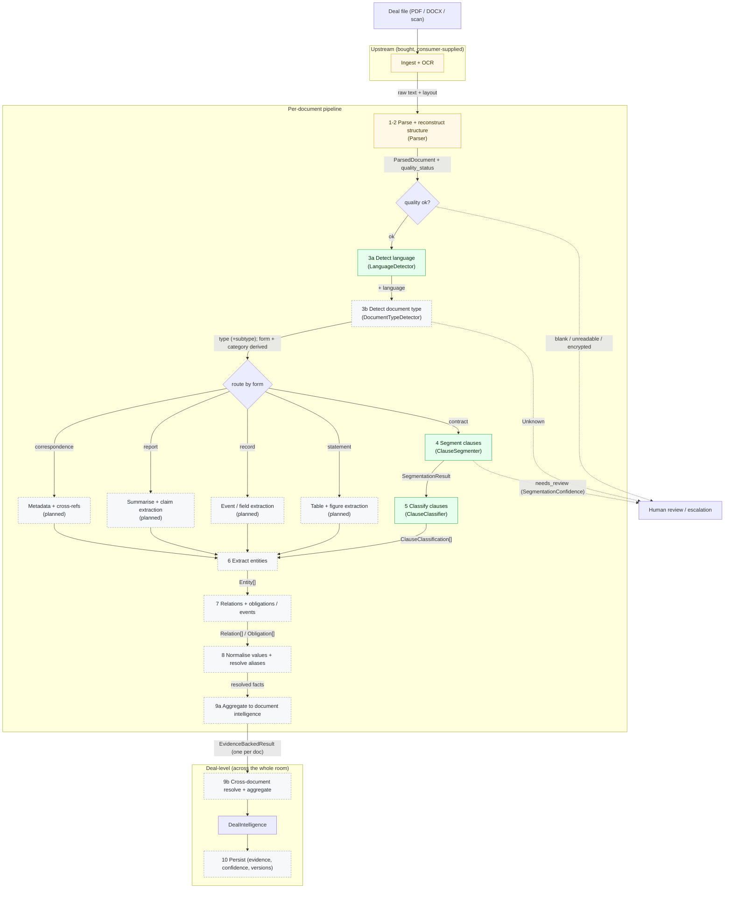

# Pipeline Architecture

A pipeline that turns each deal document into structured, evidence-backed data,
then aggregates it across the room to power AI-agent features.

## Input and output

- Input: a real deal document (PDF, DOCX, or scan), usually messy: OCR noise, headings, tables, pages.
- Output: structured facts per document, plus retrievable text. Every fact links back to its page and exact span, so it is verifiable.

## Approach

Hybrid: structured extraction as the backbone (precise, auditable, comparable, so
it powers checklists, red-flags, and conflict checks), plus embeddings and
retrieval for open-ended Q&A.

## Pipeline

Upstream (bought, not built here): parse the file and OCR it into raw text and
structure (headings, tables, pages), with page and character offsets. Our
pipeline starts from that parsed output.

## Flow diagram

Quality is assessed at parse time and gates everything after it: a document that is
blank, unreadable, or encrypted short-circuits to review before any further compute.
Language and document type are then independent sibling steps. The document-type
step predicts `type`; `form` and `category` are derived from it by lookup. `form` is
the router: it decides which stage-4+ pipeline the document enters. Solid arrows
carry the data contract named on the edge; dashed arrows are abstain / escalation
paths.

Legend: green = built in-package (segmentation, clause classification; language
detection also built, doc-type detection not yet); amber = bought / consumer-supplied;
grey dashed = interface-only or planned.

Cross-cutting on every stage (not drawn, to keep the diagram readable): each
extracted fact carries an evidence span (page + character offset), a confidence,
and a model / version stamp. That is what makes any output traceable to source.

## Stage input / output

| stage | input | output contract | status |
|---|---|---|---|
| 1-2 Parse + structure | raw file | `ParsedDocument` + `quality_status` | bought (demo: docling) |
| 3a Detect language | `ParsedDocument` | language attribute | built |
| 3b Detect document type | `ParsedDocument` (+ language) | `DetectedDocumentType` (predicts type + subtype; form, category derived) | planned |
| 4 Segment (form=contract) | `ParsedDocument` | `SegmentationResult` (clauses + confidence) | built |
| 5 Classify (form=contract) | `SegmentationResult` | `ClauseClassification[]` | built |
| statement / record / report / correspondence | `ParsedDocument` | form-specific facts | planned |
| 6 Entities | `ParsedDocument` + segments | `Entity[]` | interface-only |
| 7 Relations + obligations | `Entity[]` + segments | `Relation[]` / `Obligation[]` | interface-only |
| 8 Normalise + resolve | extracted facts | resolved, normalised facts | interface-only |
| 9a Document aggregate | all per-doc facts | `EvidenceBackedResult` | walking skeleton |
| 9b Deal aggregate | `EvidenceBackedResult[]` | `DealIntelligence` | walking skeleton |
| 10 Persist | results | stored records + provenance | engineering |
